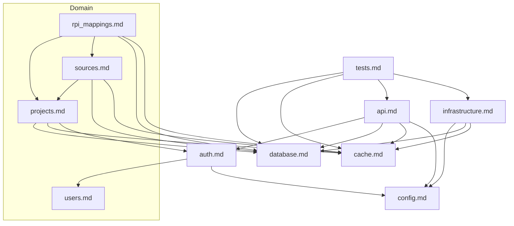

# Документация репозитория: LayerMap Backend (RPI Mapping API)

## О проекте

LayerMap Backend — это FastAPI-приложение для управления маппингом российских производственных показателей (RPI). Система позволяет создавать проекты, описывать источники данных (API, БД, файлы, стримы), определять их схему (таблицы → колонки) и связывать показатели с источниками через RPI Mapping. Аутентификация на JWT/cookie, ролевой ACL на уровне проектов, кэширование через Redis.

**Стек**: Python 3.13+, FastAPI, SQLAlchemy (async), PostgreSQL 16, Redis 7, Alembic, Pydantic, fastapi-users, httpx, pytest.

## Карта документации

| Файл | Домен | Краткое описание |
|------|-------|-----------------|
| [config.md](config.md) | Конфигурация | Pydantic Settings, переменные окружения, JWT/cookie настройки |
| [database.md](database.md) | База данных | ORM-модели (7 моделей), SQLAlchemy engine, Alembic миграции |
| [auth.md](auth.md) | Аутентификация и авторизация | fastapi-users, JWT/cookie, ACL (ProjectRole), зависимости |
| [cache.md](cache.md) | Кэширование | Redis pool, namespace-ключи, декоратор `cached`, инвалидация |
| [projects.md](projects.md) | Проекты | Project CRUD, KPI, фильтрация, статусы (draft/active/archived) |
| [sources.md](sources.md) | Источники и схемы | Source, SourceTable, SourceColumn — CRUD, типы, валидация формул |
| [rpi_mappings.md](rpi_mappings.md) | RPI Mapping | RPIMapping CRUD, статусы, фильтрация, статистика, автонумерация |
| [users.md](users.md) | Пользователи | User модель, ProjectMember, роли, UserManager |
| [api.md](api.md) | API слой | FastAPI приложение, роутеры, middleware, зависимости, схемы |
| [tests.md](tests.md) | Тестирование | Pytest структура, фикстуры, mock Redis, CI/CD тестов |
| [infrastructure.md](infrastructure.md) | Инфраструктура | Docker Compose, CI/CD (GitHub Actions), переменные окружения |

## Схема архитектуры доменов



## Быстрый старт

```bash
# 1. Клонировать репозиторий
git clone <url>
cd LayerMap_back

# 2. Создать .env файл (см. .env в репозитории)
# 3. Поднять инфраструктуру
docker compose up -d

# 4. Установить зависимости (рекомендуется venv)
python -m venv .venv
source .venv/bin/activate  # Windows: .venv\Scripts\activate
pip install -r requirements.txt
pip install -e .

# 5. Применить миграции
alembic upgrade head

# 6. Запустить сервер
uvicorn app.main:app --reload

# 7. Проверить
curl http://localhost:8000/health
```
