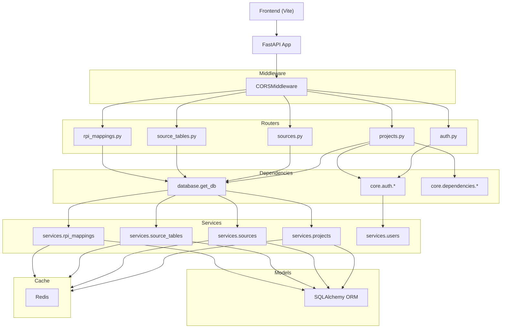

# API / Роутеры

> FastAPI-приложение, регистрация роутеров, middleware, зависимости и Pydantic-схемы.

## Расположение в репозитории

| Путь | Назначение |
|------|-----------|
| `app/main.py` | Создание FastAPI, lifespan, CORS, регистрация роутеров |
| `app/routers/` | 5 роутеров: auth, projects, sources, source_tables, rpi_mappings |
| `app/schemas/` | 25 Pydantic схем для всех сущностей |
| `app/core/dependencies.py` | Общие зависимости: ValidProject, Pagination |
| `app/core/middleware.py` | Кастомный CORSMiddleware |

## Как устроено

### Приложение

```python
app = FastAPI(
    title="RPI Mapping API",
    version="1.0.0",
    debug=settings.DEBUG,
    lifespan=lifespan,       # Redis подключение
    redirect_slashes=False,
)

app.add_middleware(
    CORSMiddleware,
    allow_origins=["http://localhost:5173", "http://localhost:3000"],
    allow_credentials=True,
    allow_methods=["*"],
    allow_headers=["*"],
)
```

### Зарегистрированные роутеры

```
/auth/*       → auth.get_auth_router()    — встроенные fastapi-users
/projects/*   → projects.router           — CRUD проектов
/projects/{id}/sources/*       → sources.router  — CRUD источников
/projects/{id}/sources/{sid}/tables/* → source_tables.router — таблицы/колонки
/projects/{id}/rpi-mappings/*  → rpi_mappings.router — RPI маппинги
/health       → встроенный                — health check
```

### CAR-диаграмма архитектуры



### Общие зависимости

```python
# Валидация существования проекта
ValidProject = Annotated[Project, Depends(get_project_or_404)]

# Пагинация
PaginationDep = Annotated[Pagination, Depends(Pagination)]
# Pagination.skip: int = 0
# Pagination.limit: int = 20 (max 100)

# Аутентификация
CurrentUser = Annotated[User, Depends(current_active_user)]
CurrentSuperuser = Annotated[User, Depends(current_superuser)]

# ACL
ProjectViewer  = Annotated[Project, Depends(require_project_role(ProjectRole.viewer))]
ProjectEditor  = Annotated[Project, Depends(require_project_role(ProjectRole.editor))]
ProjectOwner   = Annotated[Project, Depends(require_project_role(ProjectRole.owner))]
```

### Pydantic схемы

Всего 25 схем, распределение:

| Домен | Схемы |
|-------|-------|
| **User** | UserRead, UserCreate, UserUpdate (3) |
| **Project** | ProjectBase, ProjectCreate, ProjectUpdate, ProjectOut, ProjectKPIOut, ProjectSummaryOut (6) |
| **Source** | SourceBase, SourceCreate, SourceUpdate, SourceOut, SourceDetailOut (5) |
| **SourceTable** | SourceTableBase, SourceTableCreate, SourceTableUpdate, SourceTableOut (4) |
| **SourceColumn** | SourceColumnBase, SourceColumnCreate, SourceColumnUpdate, SourceColumnOut, DataType (5) |
| **RPIMapping** | RPIMappingBase, RPIMappingCreate, RPIMappingUpdate, RPIMappingOut, RPIStatsOut, MeasurementType (6) <!-- MeasurementType is actually in models -->
| **Other** | Pagination, SourceType, ColumnType, RPIStatus, ProjectRole, ProjectStatus... |

### Методы и коды ответов

- **GET** → 200, 404, 422
- **POST** → 201, 400/422 (валидация), 404, 409 (unique constraint)
- **PATCH** → 200, 404, 422
- **DELETE** → 204, 404
- **Аутентификация** → 401 (не аутентифицирован), 403 (недостаточно прав)

## Связи с другими доменами

- Все домены: [config.md](config.md), [database.md](database.md), [auth.md](auth.md), [cache.md](cache.md), [projects.md](projects.md), [sources.md](sources.md), [rpi_mappings.md](rpi_mappings.md), [users.md](users.md), [infrastructure.md](infrastructure.md), [tests.md](tests.md)

## Нюансы и ограничения

- CORS настроен на `localhost:5173` (Vite) и `localhost:3000` — для production нужно расширить список
- `redirect_slashes=False` — отключение редиректов для трейлинговых слэшей
- Два варианта эндпоинтов: `/path` и `/path/` (оба работают)
- Middleware в `app/core/middleware.py` **не используется** — в `main.py` используется `CORSMiddleware` от FastAPI (некастомизированная версия)
- Полная документация по API доступна в [API.md](../API.md)
