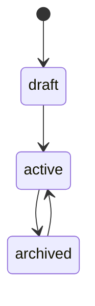

# Проекты

> Центральная сущность приложения. Проект объединяет источники, таблицы и RPI-маппинги. Пользователи получают доступ к проектам через роли.

## Расположение в репозитории

| Путь | Назначение |
|------|-----------|
| `app/models/project.py` | ORM модель Project + ProjectStatus enum |
| `app/models/project_member.py` | ORM модель ProjectMember + ProjectRole enum |
| `app/schemas/project.py` | Pydantic схемы (6 классов) |
| `app/services/projects.py` | Бизнес-логика CRUD, KPI, фильтрация |
| `app/routers/projects.py` | REST эндпоинты |

## Как устроено

### Модель

```python
class Project(Base):
    id: int
    name: str (unique)
    description: str | None
    status: ProjectStatus = draft  # active | draft | archived
    created_at: datetime
    updated_at: datetime
    # relationships
    sources → Source[]
    rpi_mappings → RPIMapping[]
    members → ProjectMember[]
```

### Статусы проекта



### Иерархия сущностей

```
Project
  ├── Source (API / DB / FILE / STREAM)
  │   └── SourceTable
  │       └── SourceColumn (dimension / metric)
  └── RPIMapping (approved / in_review / draft)
        └── SourceColumn (FK)
```

### Бизнес-логика (сервис)

- **`get_list`** — все проекты с кэшированием (ключ `projects:list`)
- **`get_one`** — проект по ID с кэшированием
- **`get_kpi`** — агрегация: total, active, draft, archived (ключ `projects:kpi`)
- **`get_recent`** — последние N проектов по `updated_at` (ключ `projects:recent`)
- **`get_filtered_list`** — поиск/фильтрация/пагинация без кэша
- **`create`** — создание проекта + добавление создателя как owner'а + инвалидация кэша
- **`update`** — PATCH-обновление + инвалидация
- **`delete`** — каскадное удаление + инвалидация
- **`check_*_access`** — три функции проверки роли (owner, editor, viewer)

### API эндпоинты

| Метод | Путь | Описание |
|-------|------|---------|
| GET | `/projects` | Список с фильтрацией (status, search, page, size, sort) |
| GET | `/projects/kpi` | KPI агрегация |
| GET | `/projects/recent` | Последние проекты |
| GET | `/projects/{id}` | Детали проекта |
| POST | `/projects` | Создание (автор становится owner) |
| PATCH | `/projects/{id}` | Обновление |
| DELETE | `/projects/{id}` | Удаление |

### Pydantic схемы

- **ProjectCreate** — name, description, status (опционально)
- **ProjectUpdate** — все поля опциональны (PATCH)
- **ProjectOut** — id, name, description, status, created_at, updated_at
- **ProjectKPIOut** — total, active, draft, archived
- **ProjectSummaryOut** — id, name, status, updated_at

## Связи с другими доменами

- [database.md](database.md) — Project, ProjectMember модели
- [sources.md](sources.md) — Source, SourceTable, SourceColumn (вложены в проект)
- [rpi_mappings.md](rpi_mappings.md) — RPIMapping (вложены в проект)
- [auth.md](auth.md) — ACL: require_project_role для доступа
- [users.md](users.md) — ProjectMember связь с User
- [cache.md](cache.md) — кэширование проектов
- [api.md](api.md) — зависимости и схемы

## Нюансы и ограничения

- При создании проекта автор автоматически добавляется как owner в `project_members`
- Кэш инвалидируется при любых мутациях
- `get_filtered_list` не кэшируется (из-за динамических параметров)
- **Нет эндпоинта для управления участниками** — owner назначается только при создании
- Unique constraint на `name` — дублирование имён проектов запрещено
