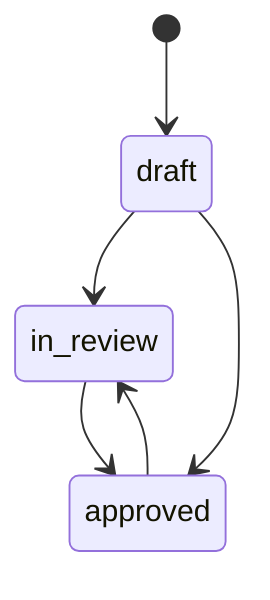

# RPI Mapping (Russian Performance Indicators)

> Основная бизнес-сущность — маппинг между показателями (RPI) и источниками данных. Поддерживает статусы, фильтрацию, статистику и расчётные показатели.

## Расположение в репозитории

| Путь | Назначение |
|------|-----------|
| `app/models/rpi_mapping.py` | ORM модель RPIMapping, RPIStatus, MeasurementType |
| `app/schemas/rpi_mapping.py` | Pydantic схемы (4 класса) |
| `app/services/rpi_mappings.py` | Бизнес-логика CRUD, stats, фильтрация |
| `app/routers/rpi_mappings.py` | REST эндпоинты |

## Как устроено

### Модель

```python
class RPIMapping(Base):
    id: int
    number: int | None            # автонумерация в рамках проекта
    project_id: int               # FK → projects
    source_column_id: int | None  # FK → source_columns (SET NULL)
    ownership: str | None         # владелец показателя
    status: RPIStatus = draft     # approved | in_review | draft
    block: str | None             # блок
    measurement_type: MeasurementType | None  # dimension | metric
    is_calculated: bool = False
    formula: str | None
    dimension: str | None
    measurement: str              # название показателя
    measurement_description: str | None
    source_report: str | None
    object_field: str             # объектное поле
    date_added: date | None
    date_removed: date | None
    comment: str | None
    verification_file: str | None
    created_at: datetime
    updated_at: datetime
```

### Check Constraint

```sql
(is_calculated = TRUE AND formula IS NOT NULL) OR (is_calculated = FALSE)
```

### Статусы RPI



### Фильтрация

Сервис `get_list` поддерживает комбинированную фильтрацию:

- **status** — approved / in_review / draft
- **ownership** — точное совпадение
- **measurement_type** — dimension / metric
- **dimension** — частичное совпадение (ILIKE)
- **is_calculated** — boolean
- **search** — поиск по полям: measurement, dimension, object_field, ownership (ILIKE)
- **skip / limit** — пагинация

Результат кэшируется с ключом `project:{id}:rpi:list:{params_hash}`.

### Статистика

Агрегация по статусам (кэшируется):

```python
class RPIStatsOut:
    total: int
    approved: int
    in_review: int
    draft: int
```

### API эндпоинты

Все под префиксом `/projects/{project_id}/rpi-mappings`:

| Метод | Путь | Описание |
|-------|------|---------|
| GET | `/stats` | Статистика по статусам |
| GET | `/` | Список с фильтрацией и пагинацией |
| GET | `/{rpi_id}` | Детали RPI |
| POST | `/` | Создание |
| PATCH | `/{rpi_id}` | Обновление |
| DELETE | `/{rpi_id}` | Удаление |

**Важно**: `/stats` должен быть объявлен до `/{rpi_id}`, иначе FastAPI пытается привести "stats" к int.

## Ключевые сущности

- **RPIStatus** — approved, in_review, draft
- **MeasurementType** — dimension, metric
- **RPIMappingCreate** — включает валидатор `formula_required_if_calculated`
- **RPIMappingUpdate** — все поля опциональны (PATCH)
- **RPIMappingOut** — включает вложенный `SourceColumnOut | None`
- **RPIStatsOut** — агрегация по статусам

## Связи с другими доменами

- [database.md](database.md) — ORM модель, FK constraints
- [projects.md](projects.md) — RPI вложен в проект
- [sources.md](sources.md) — RPIMapping.source_column → SourceColumn
- [cache.md](cache.md) — кэширование списков и статистики
- [api.md](api.md) — схемы, зависимости, валидаторы

## Нюансы и ограничения

- **Порядок регистрации эндпоинтов**: `/stats` должен быть до `/{rpi_id}` (URL-конфликт)
- Автонумерация: при создании `number` вычисляется как `max(existing.number) + 1` в рамках проекта
- При обновлении сервис делает прямой запрос к БД (минуя кэш) чтобы избежать detached-ошибок SQLAlchemy
- `source_column_id` — SET NULL при удалении колонки (RPI-запись сохраняется)
- Кэш инвалидируется по паттерну `project:{id}:rpi:*` при любых мутациях
